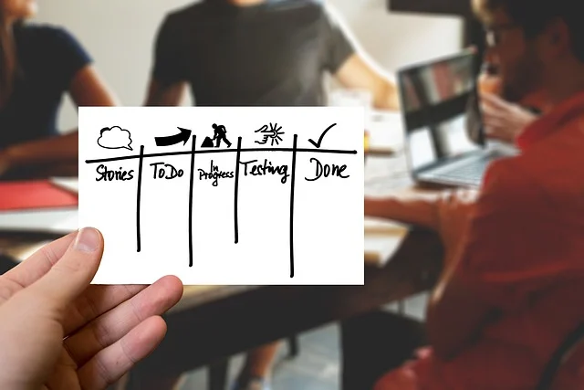

# startupManual
스타트업 빠른 의사결정과 행동력 향상을 위한 사내 매뉴얼

이 매뉴얼은 스타트업 환경에서 빠른 의사결정과 실행력을 높이기 위한 실용적인 가이드가 될 것입니다. 주요 내용으로 기획, PM, 사업관리 관련 개념, 샘플 문서 예시, 그리고 직접 작성해볼 수 있는 실습 과정을 포함하겠습니다. 특히, 1페이지 사업계획서 작성법을 중심으로 설명하겠습니다.

매뉴얼이 준비되면 공유해드릴게요!

# 스타트업 빠른 의사결정과 행동력 향상을 위한 사내 매뉴얼

## 1. 기획 (Planning)

### 기획의 개념과 스타트업에서의 중요성  
**기획**이란 목표를 달성하기 위한 **아이디어와 실행 계획을 수립하는 과정**을 말합니다. 스타트업에서는 **최소한의 핵심 계획으로 신속히 움직이는 것**이 중요합니다 ([스타트업에 있어서 얼마나 많은 계획은 지나친 계획인가  - FasterCapital](https://fastercapital.com/ko/content/%EC%8A%A4%ED%83%80%ED%8A%B8%EC%97%85%EC%97%90-%EC%9E%88%EC%96%B4%EC%84%9C-%EC%96%BC%EB%A7%88%EB%82%98-%EB%A7%8E%EC%9D%80-%EA%B3%84%ED%9A%8D%EC%9D%80-%EC%A7%80%EB%82%98%EC%B9%9C-%EA%B3%84%ED%9A%8D%EC%9D%B8%EA%B0%80.html#:~:text=%EB%A8%BC%EC%A0%80%20%EC%8A%A4%ED%83%80%ED%8A%B8%EC%97%85%EC%9D%98%20%EA%B7%9C%EB%AA%A8%EB%A5%BC%20%EA%B3%A0%EB%A0%A4%ED%95%B4%EB%B3%B4%EC%84%B8%EC%9A%94,%EA%B2%B0%EC%A0%95%EC%9D%84%20%EB%82%B4%EB%A6%B4%20%EC%88%98%20%EC%9E%88%EA%B8%B0%20%EB%95%8C%EB%AC%B8%EC%9E%85%EB%8B%88%EB%8B%A4)). 과도한 계획 수립은 실행을 지연시키고 민첩성을 떨어뜨릴 수 있으므로, **핵심 목표와 이정표 위주의 간결한 계획**을 세워 빠르게 행동하고 필요에 따라 계획을 보완하는 것이 좋습니다 ([스타트업에 있어서 얼마나 많은 계획은 지나친 계획인가  - FasterCapital](https://fastercapital.com/ko/content/%EC%8A%A4%ED%83%80%ED%8A%B8%EC%97%85%EC%97%90-%EC%9E%88%EC%96%B4%EC%84%9C-%EC%96%BC%EB%A7%88%EB%82%98-%EB%A7%8E%EC%9D%80-%EA%B3%84%ED%9A%8D%EC%9D%80-%EC%A7%80%EB%82%98%EC%B9%9C-%EA%B3%84%ED%9A%8D%EC%9D%B8%EA%B0%80.html#:~:text=%EB%A8%BC%EC%A0%80%20%EC%8A%A4%ED%83%80%ED%8A%B8%EC%97%85%EC%9D%98%20%EA%B7%9C%EB%AA%A8%EB%A5%BC%20%EA%B3%A0%EB%A0%A4%ED%95%B4%EB%B3%B4%EC%84%B8%EC%9A%94,%EA%B2%B0%EC%A0%95%EC%9D%84%20%EB%82%B4%EB%A6%B4%20%EC%88%98%20%EC%9E%88%EA%B8%B0%20%EB%95%8C%EB%AC%B8%EC%9E%85%EB%8B%88%EB%8B%A4)). 한 페이지로 요약된 기획 문서나 **원페이지 사업계획서** 등이 스타트업에 적합한 기획 방식입니다. 이는 **핵심 내용만 추려낸 간결한 계획서**로, 이해관계자들과 빠르게 아이디어를 공유하고 협업을 이끌어내는 데 효과적입니다 ([원페이지 기획서 작성 방법 및 주의 사항 예시 포함](https://ssinarrak.tistory.com/492#:~:text=%27%EC%9B%90%ED%8E%98%EC%9D%B4%EC%A7%80%20%EA%B8%B0%ED%9A%8D%EC%84%9C%28One,%EB%B0%A9%EB%B2%95%EA%B3%BC%20%EC%A3%BC%EC%9D%98%20%EC%82%AC%ED%95%AD%EC%97%90%20%EB%8C%80%ED%95%9C%20%EA%B0%80%EC%9D%B4%EB%93%9C%EC%9E%85%EB%8B%88%EB%8B%A4)).

 *원페이지 사업계획서 개념 예시: 사업 계획의 핵심 요소들(시장, 고객, 수익 모델 등)을 한 페이지에 도식화한 모습. 불필요한 세부내용은 배제하고 **비즈니스 아이디어의 본질**을 명확히 담아내어, 누구나 빠르게 이해하고 피드백을 줄 수 있도록 구성합니다.*

스타트업에서 기획은 거창한 문서 작업이 아니라 **방향성 정립과 팀 합의**에 초점을 맞춥니다. 팀원 모두가 **무엇을 목표로 하고 어떻게 실행할지 공감대를 형성**하도록 돕는 것이 기획의 역할입니다. 이를 통해 **빠른 의사결정**이 가능해지고, 모두가 같은 방향을 바라보면서 민첩하게 움직일 수 있습니다. 요약하면 스타트업의 기획은 **“빠르게 쓰고 바로 실행하며 필요하면 즉시 수정하는”** 유연한 계획이어야 합니다.

### 1페이지 사업계획서 작성법  
스타트업에서는 투자 유치용의 장황한 사업계획서보다 **내부 실행력을 높이는 1페이지 사업계획서**가 유용합니다. 한 페이지 사업계획서를 작성할 때는 다음 요소를 간략히 포함합니다:

- **문제 정의**: 고객이 겪는 문제나 필요는 무엇인가? (예: “소형 자영업자의 재고관리 어려움”)  
- **해결 방안**: 우리 제품/서비스가 그 문제를 어떻게 해결하는가? (예: “모바일 앱으로 실시간 재고 추적 제공”)  
- **시장 및 타겟**: 목표로 하는 **고객 세그먼트와 시장 규모**는? 주요 고객 특성과 니즈를 한 줄로 요약.  
- **비즈니스 모델**: **수익을 내는 방법**은? 수익원과 가격 전략, 비용 구조의 개요.  
- **경쟁 우위**: 경쟁사 대비 우리 서비스의 **차별점**은? (예: 기술 특허, 독특한 공급망 등)  
- **팀 구성** (필요한 경우): 핵심 팀원의 역량 소개를 짧게 추가.  
- **핵심 지표**: 성공을 가늠할 **핵심 성과지표(KPI)** 또는 현재까지 얻은 성과 (예: 베타테스터 100명 확보).  

각 항목은 **한두 문장 또는 핵심 키워드**로 요약하며, 문장보다는 **불릿 포인트**로 정리해도 좋습니다. 전체 문서는 **A4 한 페이지**를 넘지 않도록 제한하여 **핵심만 담는 연습**을 합니다 ([원페이지 기획서 작성 방법 및 주의 사항 예시 포함](https://ssinarrak.tistory.com/492#:~:text=,%EB%8D%94%EC%9A%B1%20%EC%84%A4%EB%93%9D%EB%A0%A5%EC%9D%84%20%EB%86%92%EC%9D%BC%20%EC%88%98%20%EC%9E%88%EC%8A%B5%EB%8B%88%EB%8B%A4)). 이렇게 작성된 1페이지 사업계획서는 팀 내부는 물론 투자자나 멘토에게도 빠르게 **사업 개요를 전달**하고 피드백을 받는 용도로 활용할 수 있습니다.

### 샘플 문서 예시 및 실습 과제  
- **샘플 예시**: 가상의 스타트업 사례로 1페이지 사업계획서를 작성해봅니다. 예를 들어, **“오피스 간식 배달 서비스”**를 주제로 문제 정의부터 수익모델까지 한 페이지에 정리합니다. 작성한 문서는 동료들과 공유하여 **내용이 명확한지, 빠르게 이해되는지** 피드백을 받아보세요.  
- **실습 과제**: 우리 회사 또는 팀에서 추진 중인 프로젝트에 대해 **원페이지 기획서**를 작성해보십시오. 위의 항목들을 참고하여 핵심 내용만 간략히 담습니다. 작성 후에는 팀원들과 공유하여 **의견을 수렴**하고, 필요한 부분을 보완해보세요. 이 과정을 통해 **기획 단계에서의 빠른 합의 형성**과 **아이디어 개선**을 경험하게 될 것입니다.

---

## 2. PM (프로젝트 매니지먼트)

### PM의 개념 및 역할  
**프로젝트 매니지먼트(PM)**란 주어진 목표를 달성하기 위해 **프로젝트의 전체 과정을 계획하고 실행을 관리하는 활동**입니다. 프로젝트 매니저(PM)는 **프로젝트의 시작부터 종료까지 일정, 자원, 인력을 조율**하며 목표 달성을 이끄는 리더 역할을 합니다 ([프로젝트 매니저(PM)란 무엇인가? 역할, 중요성, 그리고 PM이 되기 위한 방법](https://particleseoul.tistory.com/877#:~:text=,%EB%82%B4%EC%97%90%EC%84%9C%20%EB%A7%A4%EC%9A%B0%20%EC%A4%91%EC%9A%94%ED%95%9C%20%EC%97%AD%ED%95%A0%EC%9D%84%20%EC%88%98%ED%96%89%ED%95%A9%EB%8B%88%EB%8B%A4)). 다시 말해, **프로젝트 기획, 수행, 통제, 마무리에 걸친 모든 단계**에 책임을 지고, 팀원들이 각자의 역할을 원활히 수행하도록 돕는 **조정자**입니다 ([프로젝트 매니저(PM)란 무엇인가? 역할, 중요성, 그리고 PM이 되기 위한 방법](https://particleseoul.tistory.com/877#:~:text=,%EB%82%B4%EC%97%90%EC%84%9C%20%EB%A7%A4%EC%9A%B0%20%EC%A4%91%EC%9A%94%ED%95%9C%20%EC%97%AD%ED%95%A0%EC%9D%84%20%EC%88%98%ED%96%89%ED%95%A9%EB%8B%88%EB%8B%A4)). 

스타트업에서는 전담 PM이 없더라도 **누군가는 프로젝트 관리 업무**를 맡아야 합니다. 규모가 작은 스타트업일수록 한 사람이 **여러 역할을 겸하기 때문에**, PM의 역할도 유연하게 분담됩니다. 중요한 것은 **프로젝트의 우선순위 결정, 진행 상황 모니터링, 문제 발생 시 조치** 등 기본적인 PM 기능을 팀이 수행하는 것입니다. **일정 관리, 목표 설정, 역할 분담, 커뮤니케이션**이 원활히 이뤄지도록 모두가 PM 마인드를 갖고 움직여야 합니다.

### 스타트업에서의 PM 업무 프로세스  
스타트업의 프로젝트 관리 프로세스는 대기업처럼 복잡한 절차보다 **기민하고 효율적인 흐름**을 지향합니다. 일반적인 단계는 다음과 같습니다:

1. **프로젝트 목표 설정 및 계획 수립**: 해결하려는 문제와 달성할 목표를 명확히 정의합니다. 작은 스타트업에서는 이 단계에서 **과도한 문서 작업을 지양**하고, 핵심 목표와 기간, 담당자를 간단히 정리합니다. 필요하면 **간략한 프로젝트 계획서**(목표, 기간, 책임자, 주요 마일스톤 포함)를 작성합니다.  
2. **업무 분담 및 일정 관리**: 팀원들의 역할과 주요 작업(Task)을 나누고 **우선순위**를 정합니다. 스타트업에서는 구두나 채팅으로도 빠르게 분담이 이루어질 수 있지만, **공유된 To-Do 리스트나 칸반 보드**를 활용하면 모두가 진행 상황을 한눈에 볼 수 있습니다. 짧은 주기의 **스프린트(Sprint)**나 주간 단위 일정을 활용하여 **유연하게 일정**을 운영합니다.  
3. **실행 및 커뮤니케이션**: 프로젝트 실행 중에는 **일일 또는 주간 스탠드업 미팅**(짧은 진행 점검 회의) 등을 통해 서로 진행 상황을 공유합니다. 이때 **문제 발생 사항, 도움이 필요한 부분**을 빠르게 파악하여 해결하도록 합니다. 팀내 소통은 수시로 이루어지며, 필요시 대면 회의보다 Slack, 카카오톡 등 **실시간 메신저와 협업툴**로 신속히 의견 교환을 하는 문화가 효과적입니다.  
4. **모니터링 및 조정**: PM 역할을 맡은 사람이나 팀 리더는 전체 진행 상황을 **모니터링**합니다. 일정 지연이나 장애 요소가 발견되면 즉시 계획을 조정합니다. 스타트업에서는 변경에 유연해야 하므로, **초기 계획 대비 우선순위나 일정 변경**을 주저하지 않고 수행합니다. 중요한 것은 최종 목표를 향해 **방향을 틀지 않고 진척을 내는 것**입니다.  
5. **프로젝트 완료 및 회고**: 프로젝트가 완료되면 **성과를 검증**합니다 (예: 출시된 제품의 사용자 반응, 지표 달성 여부 등). 간단한 **회고 미팅**을 통해 잘 된 점과 개선할 점을 팀원들과 공유합니다. 이 회고를 바탕으로 다음 프로젝트 관리에 **교훈을 반영**하여 지속적으로 프로세스를 개선합니다.

요약하면, 스타트업의 PM 프로세스는 **“계획 간소화 → 빠른 실행/소통 → 수시로 조정 → 회고”**의 사이클로 돌아갑니다. 문서보다는 **실행과 커뮤니케이션**에 비중을 두고, 최소한의 프로세스로 **최대의 효율**을 내는 것을 목표로 합니다.

### 효과적인 프로젝트 관리 방법  
스타트업에서 프로젝트를 효과적으로 관리하기 위해 활용할 수 있는 기법과 팁은 다음과 같습니다:

- **애자일 방법론 도입**: 변화에 유연하게 대응하기 위해 스크럼(Scrum)이나 칸반(Kanban) 같은 **애자일(Agile) 방법론**을 부분적으로 적용합니다. 예를 들어 1~2주 단위의 **스프린트**를 실행하고, 데일리 스크럼으로 매일 10분씩 진행 상황을 공유하면 팀의 집중력과 속도를 높일 수 있습니다. 작업 시각화 도구로 칸반 보드를 사용하면 투명성을 높이고 **병목을 빠르게 발견**할 수 있습니다.  
- **칸반 보드 활용**: 칸반 보드는 **해야 할 일(To Do)**, **진행 중(In Progress)**, **완료(Done)** 등의 칸을 만들어 팀 업무를 시각적으로 관리하는 도구입니다. Trello, Jira 등의 툴이나 화이트보드에 포스트잇을 붙여 사용합니다. 칸반 보드를 쓰면 현재 모든 업무의 상태를 한눈에 파악할 수 있어 **우선순위 조정과 자원 배분**을 빠르게 결정할 수 있습니다.  
- **의사소통의 빈도와 투명성**: **“정보는 공유된다”**는 원칙으로 팀 내 소통을 강화합니다. 작은 팀일수록 서로 자주 이야기하는 것이 중요합니다. 진행 상황, 이슈, 아이디어를 실시간으로 공유하고 논의할 수 있는 분위기를 조성하세요. 이를 위해 Slack, Notion, Google Docs 등 **클라우드 협업툴**을 적극 활용하여 **누구나 현재 상태와 다음 할 일을 쉽게 확인**할 수 있게 합니다.  
- **우선순위와 범위 관리**: 스타트업 프로젝트는 자원이 한정적이므로 **우선순위 관리**가 성과를 좌우합니다. 꼭 필요한 기능이나 과업에 집중하고, 부가적인 부분은 과감히 **후순위**로 미룹니다. 또한 프로젝트 범위가 통제 없이 확장(scope creep)되지 않도록 주의합니다. 범위 변화가 필요하다면 **그에 따른 일정/자원 조정**이 함께 논의되어야 합니다.  
- **리스크 관리**: 작은 팀이라도 **위험 요소를 사전에 인지하고 대비책**을 생각해두면 문제 발생 시 대응이 빨라집니다. 예를 들어 핵심 인력의 갑작스런 부재, 주요 기능 구현 실패 등의 시나리오에 대한 대체 계획을 가볍게라도 마련해 두세요. 문제가 터지면 **임기응변으로 해결**하기보다, 미리 생각해둔 플랜 B가 있으면 **의사결정이 한결 수월**합니다.  
- **문서화와 기록**: 최소한의 문서화를 하되, **핵심 결정사항과 교훈은 기록**으로 남깁니다. 예를 들어 주요 회의에서 결정된 사항은 요약해서 공유하거나, 프로젝트 완료 후 간단한 회고록을 작성해 둡니다. 이것이 쌓이면 새로운 프로젝트를 시작할 때 **지식 자산**이 되어 시행착오를 줄일 수 있습니다. 단, 기록은 **실행을 방해하지 않을 정도로만 최소화**하는 균형이 필요합니다.

*스타트업 팀의 칸반 보드 활용 예시: 손글씨로 작성된 Kanban 보드를 통해 Stories, To Do, In Progress, Testing, Done의 **단계별로 작업 현황을 시각화**하고 있다. 팀원들이 진행 상황을 실시간으로 공유함으로써 **업무 상태를 한눈에 파악**하고, 변경이나 의사결정을 빠르게 내릴 수 있다.*

이러한 기법들을 상황에 맞게 적용하면, 작은 조직이라도 **체계 있는 프로젝트 관리**를 통해 **속도와 품질**을 모두 높일 수 있습니다. 핵심은 어렵거나 복잡한 방법론을 모두 따라하기보다, **우리 팀에 맞는 방식으로 응용**하여 **일관성 있게 운영**하는 것입니다.

### 샘플 문서 예시 및 실습 과제  
- **샘플 예시**: 현재 진행 중이거나 예정된 작은 프로젝트를 하나 선정합니다. 이에 대한 **프로젝트 개요 문서**(한 페이지 분량)를 만들어보십시오. 예컨대, 새로운 기능 개발 프로젝트라면 목표, 담당자, 기간, 주요 작업 항목, 위험 요소를 표로 정리합니다. 또한 **간단한 칸반 보드**를 만들어 해당 프로젝트의 작업들을 분류해보세요 (직접 화이트보드에 쓰거나 툴을 사용). 이를 팀원들과 공유하여 **프로젝트 계획에 대한 의견**을 모으고 개선합니다.  
- **실습 과제**: 팀 단위로 **애자일 스프린트**를 1주일간 시도해 봅니다. 월요일에 이번 주 목표와 할 일을 정의하고 칸반 보드에 작성합니다. 매일 5분씩 짧은 스탠드업 미팅을 실시하여 진행 사항을 말해보고 금요일에 결과를 공유합니다. 스프린트가 끝난 후 **회고 시간**을 가져, 잘 된 점과 부족한 점을 정리해보세요. 이 실습을 통해 **애자일한 프로젝트 진행 방식**이 팀 생산성에 주는 영향을 직접 느껴보고, 향후 우리 팀만의 프로젝트 관리 방식에 반영합니다.

---

## 3. 사업관리 (Business Management)

### 사업관리의 개념 및 스타트업에서의 중요성  
**사업관리**란 회사의 비즈니스를 운영하면서 **성과를 측정하고 개선하는 일련의 관리 활동**을 의미합니다. 구체적으로는 **목표 설정, 자원 운영, 성과 모니터링, 프로세스 개선** 등을 포괄합니다. 스타트업에서는 제품 개발 못지않게 **비즈니스 운영 전반을 관리하는 역량**이 중요합니다. 왜냐하면 제한된 자원으로 **효율적으로 성장**해야 하고, 작은 시행착오도 회사 존립에 크게 영향을 줄 수 있기 때문입니다. 사업관리의 궁극적 목적은 **지속적인 성장과 생존**을 확보하는 것입니다.

스타트업에서 사업관리는 대기업의 그것과 달리 **유연하고 신속하게** 이루어져야 합니다. **데이터와 지표를 기반으로 빠르게 의사결정**하고 전략을 조정하는 능력은 필수적입니다 ([성과 측정: 성장 촉진: 성과 측정이 스타트업에 힘을 실어주는 방법 - FasterCapital](https://fastercapital.com/ko/content/%EC%84%B1%EA%B3%BC-%EC%B8%A1%EC%A0%95--%EC%84%B1%EC%9E%A5-%EC%B4%89%EC%A7%84--%EC%84%B1%EA%B3%BC-%EC%B8%A1%EC%A0%95%EC%9D%B4-%EC%8A%A4%ED%83%80%ED%8A%B8%EC%97%85%EC%97%90-%ED%9E%98%EC%9D%84-%EC%8B%A4%EC%96%B4%EC%A3%BC%EB%8A%94-%EB%B0%A9%EB%B2%95.html#:~:text=%EC%8A%A4%ED%83%80%ED%8A%B8%EC%97%85%20%EC%84%B1%EC%9E%A5%EC%9D%98%20%EC%97%AD%EB%8F%99%EC%A0%81%EC%9D%B8%20%ED%99%98%EA%B2%BD%EC%97%90%EC%84%9C%20%EC%A7%84%ED%96%89,%EC%9D%B4%EC%96%B4%EC%A7%80%EB%8A%94%20%ED%99%98%EA%B2%BD%EC%9D%84%20%EC%A1%B0%EC%84%B1%ED%95%A0%20%EC%88%98%20%EC%9E%88%EC%8A%B5%EB%8B%88%EB%8B%A4)). 예컨대 **월 단위의 재무제표 검토, 주 단위의 핵심 지표(KPI) 체크** 등을 통해 사업의 건강 상태를 수시로 파악합니다. 또한 외부 환경 변화나 고객 피드백에 따라 **전략을 수시로 수정(pivot)**하는 등 기민한 대응이 요구됩니다. **“만들고 측정하고 학습한다”**는 **린 스타트업 철학**을 사업 운영 전반에 적용하여, 검증된 것에 자원을 집중하고 불필요한 활동을 과감히 줄이는 방향으로 관리해야 합니다.

한마디로 스타트업의 사업관리는 **“나침반과 같은 역할”**을 합니다. 혼돈스러운 시장 환경 속에서 측정과 분석을 통해 **현재 위치와 나아갈 방향**을 제시해주고 ([성과 측정: 성장 촉진: 성과 측정이 스타트업에 힘을 실어주는 방법 - FasterCapital](https://fastercapital.com/ko/content/%EC%84%B1%EA%B3%BC-%EC%B8%A1%EC%A0%95--%EC%84%B1%EC%9E%A5-%EC%B4%89%EC%A7%84--%EC%84%B1%EA%B3%BC-%EC%B8%A1%EC%A0%95%EC%9D%B4-%EC%8A%A4%ED%83%80%ED%8A%B8%EC%97%85%EC%97%90-%ED%9E%98%EC%9D%84-%EC%8B%A4%EC%96%B4%EC%A3%BC%EB%8A%94-%EB%B0%A9%EB%B2%95.html#:~:text=%EC%8A%A4%ED%83%80%ED%8A%B8%EC%97%85%20%EC%84%B1%EC%9E%A5%EC%9D%98%20%EC%97%AD%EB%8F%99%EC%A0%81%EC%9D%B8%20%ED%99%98%EA%B2%BD%EC%97%90%EC%84%9C%20%EC%A7%84%ED%96%89,%EC%9D%B4%EC%96%B4%EC%A7%80%EB%8A%94%20%ED%99%98%EA%B2%BD%EC%9D%84%20%EC%A1%B0%EC%84%B1%ED%95%A0%20%EC%88%98%20%EC%9E%88%EC%8A%B5%EB%8B%88%EB%8B%A4)), 제한된 인력이 **올바른 목표에 에너지**를 쏟도록 하는 것입니다. 이를 위해서는 팀 내에 **숫자에 기반한 객관적인 문화**와 **지속 개선하려는 태도**가 자리잡아야 합니다.

### 스타트업에서의 사업 운영 방법  
작은 조직에서는 거창한 경영 기법보다는 **현실적인 운영 원칙**을 세우고 따르는 것이 중요합니다. 스타트업이 고려할 사업 운영 방법과 원칙은 다음과 같습니다:

- **핵심 지표(KPI) 선정과 추적**: 우리 비즈니스의 성공을 가늠할 **핵심 지표**를 몇 가지 선정합니다. 예를 들어 앱 서비스라면 **사용자 활성화 수, 이탈률, ARPU(유저당 평균 매출)** 등이 될 수 있습니다. 지표는 너무 많기보다는 **핵심만 소수**로 정하고, **정기적으로 수치를 추적 및 공유**합니다. 지표 변화를 통해 **성장세를 확인하거나 문제를 조기에 발견**할 수 있습니다.  
- **짧은 피드백 루프**: 분기별 또는 연간 단위의 경영계획만 세우고 방치하지 말고, **짧은 주기로 검토**합니다. 예컨대 **월간 목표와 실적 리뷰** 미팅을 통해 지난 한 달을 돌아보고 바로 다음달 계획을 조정합니다. 스타트업은 환경 변화가 빠르므로, **계획-실행-검토-개선(PDCA)** 사이클을 가능한 한 짧게 가져가세요. **린 스타트업의 Build-Measure-Learn** 사이클처럼, **작게 실험하고 배운 뒤 개선**하는 접근이 효과적입니다 ([성과 측정: 성장 촉진: 성과 측정이 스타트업에 힘을 실어주는 방법 - FasterCapital](https://fastercapital.com/ko/content/%EC%84%B1%EA%B3%BC-%EC%B8%A1%EC%A0%95--%EC%84%B1%EC%9E%A5-%EC%B4%89%EC%A7%84--%EC%84%B1%EA%B3%BC-%EC%B8%A1%EC%A0%95%EC%9D%B4-%EC%8A%A4%ED%83%80%ED%8A%B8%EC%97%85%EC%97%90-%ED%9E%98%EC%9D%84-%EC%8B%A4%EC%96%B4%EC%A3%BC%EB%8A%94-%EB%B0%A9%EB%B2%95.html#:~:text=3,%EC%B5%9C%EC%86%8C%20%EC%8B%A4%ED%96%89%20%EA%B0%80%EB%8A%A5%20%EC%A0%9C%ED%92%88%29%EB%A5%BC%20%EC%B6%9C%EC%8B%9C%ED%95%98%EA%B3%A0)).  
- **재무 건전성 관리**: 투자금을 확보했다 해도 **런웨이(runway)**를 늘 신경써야 합니다. 매월의 **현금 흐름**을 점검하고 비용을 통제합니다. 불필요한 지출을 최소화하되, 성장에 필수적인 지출(예: 마케팅, 인재 채용)은 **투자**로 간주하고 적절히 배분합니다. **손익분기점 도달 시점**을 계산해보고, 추가 자금이 필요할 경우를 대비해 **자금 조달 플랜**도 항상 염두에 둡니다.  
- **팀 생산성 및 조직 건강 체크**: 스타트업의 **인적자원 관리**도 사업관리의 일부입니다. 팀원의 **업무 몰입도, 워크로드, 사기** 등을 주기적으로 살핍니다. 작은 조직일수록 **개개인의 역량과 컨디션**이 성과에 크게 영향을 미칩니다. 정기적으로 1:1 미팅이나 팀 피드백 세션을 가져 **애로사항을 듣고 해결**하며, 필요하면 **채용이나 역할 조정을 통해 인력 운영 최적화**를 합니다.  
- **고객 피드백과 시장 트렌드 반영**: 사업 운영 방침을 정하되, **항상 유연성**을 유지합니다. 고객의 사용 피드백, 시장의 트렌드 변화를 사업관리 지표에 반영하세요. 예를 들어 고객 지원 이슈 증가율, 신규 고객 유입 경로 변화 등도 사업관리의 한 부분으로 모니터링합니다. 외부 환경 변화에 빠르게 대응하기 위해 **주요 뉴스, 경쟁사 동향**도 팀 내 공유하여 모두가 인지하도록 합니다.  
- **일관된 비전 유지와 전략 조정**: 단기 실행은 유연하게 하면서도, **큰 비전과 방향**은 구성원들이 상기할 수 있게 합니다. 분주한 일상 업무 중에도 **우리의 궁극적 미션**(예: “소상공인의 삶을 편하게 한다”)을 되새기고, 현재 전략이 이에 부합하는지 점검합니다. 만약 사업 데이터나 외부 요인으로 **근본적인 전략 수정**(Pivot)이 필요하다고 판단되면, **팀과 충분히 논의하고 신속히 결정 및 실행**합니다. **과감한 전략 전환**도 스타트업 사업관리의 한 부분입니다.

이러한 운영 방법들은 결국 **데이터에 기반한 의사결정**과 **지속적인 개선 문화**로 귀결됩니다. 스타트업 팀은 실험精神을 갖되 결과에 대한 엄밀한 측정을 통해 **무엇이 효과 있고 없는지 배우는 조직**이 되어야 합니다 ([성과 측정: 성장 촉진: 성과 측정이 스타트업에 힘을 실어주는 방법 - FasterCapital](https://fastercapital.com/ko/content/%EC%84%B1%EA%B3%BC-%EC%B8%A1%EC%A0%95--%EC%84%B1%EC%9E%A5-%EC%B4%89%EC%A7%84--%EC%84%B1%EA%B3%BC-%EC%B8%A1%EC%A0%95%EC%9D%B4-%EC%8A%A4%ED%83%80%ED%8A%B8%EC%97%85%EC%97%90-%ED%9E%98%EC%9D%84-%EC%8B%A4%EC%96%B4%EC%A3%BC%EB%8A%94-%EB%B0%A9%EB%B2%95.html#:~:text=4,%EC%9E%88%EB%8A%94%20%ED%8C%A8%ED%84%B4%EC%9D%84%20%EB%93%9C%EB%9F%AC%EB%82%BC%20%EC%88%98%20%EC%9E%88%EC%8A%B5%EB%8B%88%EB%8B%A4)). 숫자와 사용자 반응이 말해주는 바를 겸허히 받아들이고, 잘못된 가설은 빨리 폐기하며, 새로운 시도를 두려워하지 않는 것이 스타트업 사업관리의 핵심입니다.

### 성과 측정 및 개선 프로세스  
성과를 체계적으로 측정하고 개선하는 과정은 다음과 같이 실행할 수 있습니다:

1. **명확한 목표 설정**: 측정 이전에 **무엇을 달성하려는지 명확한 목표**를 세웁니다. 목표는 가능하면 **정량적 지표**로 표현합니다 (예: “분기 내에 활성 사용자 수 20% 증가”와 같이) ([성과 측정: 성장 촉진: 성과 측정이 스타트업에 힘을 실어주는 방법 - FasterCapital](https://fastercapital.com/ko/content/%EC%84%B1%EA%B3%BC-%EC%B8%A1%EC%A0%95--%EC%84%B1%EC%9E%A5-%EC%B4%89%EC%A7%84--%EC%84%B1%EA%B3%BC-%EC%B8%A1%EC%A0%95%EC%9D%B4-%EC%8A%A4%ED%83%80%ED%8A%B8%EC%97%85%EC%97%90-%ED%9E%98%EC%9D%84-%EC%8B%A4%EC%96%B4%EC%A3%BC%EB%8A%94-%EB%B0%A9%EB%B2%95.html#:~:text=1,%EC%8B%A4%EC%A7%88%EC%A0%81%EC%9D%B8%20%EB%AA%A9%ED%91%9C%EB%A5%BC%20%EC%84%A4%EC%A0%95%ED%95%A0%20%EC%88%98%20%EC%9E%88%EC%8A%B5%EB%8B%88%EB%8B%A4)). 이러한 목표 설정이 사업관리의 출발점이며, 팀원들에게도 **분명한 지향점**을 제공합니다.  
2. **핵심 성과 지표(KPI) 정의**: 설정한 목표와 관련이 높은 **핵심 지표**들을 선정합니다. 앞서 예시의 경우 *MAU(Monthly Active Users)* 증가 목표라면, **신규 가입자 수, 기존 사용자 유지율, 일일 활성사용자(DAU)** 등의 지표를 함께 추적할 수 있습니다. 이때 KPI는 **전사적 목표와 직접적으로 연관**되어야 함을 기억합니다 ([성과 측정: 성장 촉진: 성과 측정이 스타트업에 힘을 실어주는 방법 - FasterCapital](https://fastercapital.com/ko/content/%EC%84%B1%EA%B3%BC-%EC%B8%A1%EC%A0%95--%EC%84%B1%EC%9E%A5-%EC%B4%89%EC%A7%84--%EC%84%B1%EA%B3%BC-%EC%B8%A1%EC%A0%95%EC%9D%B4-%EC%8A%A4%ED%83%80%ED%8A%B8%EC%97%85%EC%97%90-%ED%9E%98%EC%9D%84-%EC%8B%A4%EC%96%B4%EC%A3%BC%EB%8A%94-%EB%B0%A9%EB%B2%95.html#:~:text=2,%EC%A1%B0%EA%B8%B0%20%EA%B2%BD%EA%B3%A0%EB%A5%BC%20%EC%A0%9C%EA%B3%B5%ED%95%A0%20%EC%88%98%20%EC%9E%88%EC%8A%B5%EB%8B%88%EB%8B%A4)).  
3. **데이터 수집 및 모니터링**: 정의된 지표를 **정기적으로 측정**합니다. 가능한 자동화된 분석 도구나 대시보드를 활용해 실시간으로 확인할 수도 있습니다. 예를 들어 웹서비스 스타트업이라면 **Google Analytics, Amplitude** 등의 툴로 트래픽과 전환율을 모니터링합니다. 또한 **주간/월간 성과 리포트**를 만들어 팀과 공유하여 모두가 숫자를 인지하게 합니다.  
4. **성과 분석 및 인사이트 도출**: 수집된 데이터에 대해 **원인과 추세를 분석**합니다. 목표 대비 어느 정도 달성했는지, 계획과 비교해 **차이가 있다면 그 이유는 무엇인지** 토의합니다. 이때 **정량 데이터뿐 아니라 정성 피드백**도 함께 고려합니다 ([성과 측정: 성장 촉진: 성과 측정이 스타트업에 힘을 실어주는 방법 - FasterCapital](https://fastercapital.com/ko/content/%EC%84%B1%EA%B3%BC-%EC%B8%A1%EC%A0%95--%EC%84%B1%EC%9E%A5-%EC%B4%89%EC%A7%84--%EC%84%B1%EA%B3%BC-%EC%B8%A1%EC%A0%95%EC%9D%B4-%EC%8A%A4%ED%83%80%ED%8A%B8%EC%97%85%EC%97%90-%ED%9E%98%EC%9D%84-%EC%8B%A4%EC%96%B4%EC%A3%BC%EB%8A%94-%EB%B0%A9%EB%B2%95.html#:~:text=match%20at%20L201%202,%EC%A1%B0%EA%B8%B0%20%EA%B2%BD%EA%B3%A0%EB%A5%BC%20%EC%A0%9C%EA%B3%B5%ED%95%A0%20%EC%88%98%20%EC%9E%88%EC%8A%B5%EB%8B%88%EB%8B%A4)) ([성과 측정: 성장 촉진: 성과 측정이 스타트업에 힘을 실어주는 방법 - FasterCapital](https://fastercapital.com/ko/content/%EC%84%B1%EA%B3%BC-%EC%B8%A1%EC%A0%95--%EC%84%B1%EC%9E%A5-%EC%B4%89%EC%A7%84--%EC%84%B1%EA%B3%BC-%EC%B8%A1%EC%A0%95%EC%9D%B4-%EC%8A%A4%ED%83%80%ED%8A%B8%EC%97%85%EC%97%90-%ED%9E%98%EC%9D%84-%EC%8B%A4%EC%96%B4%EC%A3%BC%EB%8A%94-%EB%B0%A9%EB%B2%95.html#:~:text=match%20at%20L234%20%EC%9E%88%EC%8A%B5%EB%8B%88%EB%8B%A4,%ED%94%BC%EB%93%9C%EB%B0%B1%20%EC%96%91%EC%8B%9D%EC%9D%84%20%EB%8F%84%EC%9E%85%ED%95%A0%20%EC%88%98%20%EC%9E%88%EC%8A%B5%EB%8B%88%EB%8B%A4)). 숫자가 증가했지만 고객 불만이 늘었다면 속도보다 품질 이슈를 점검해야 합니다. **데이터에 숨은 의미**를 해석하는 것이 중요합니다.  
5. **개선 액션 수립**: 분석 결과에 따라 **다음 행동을 결정**합니다. 목표를 초과 달성한 부분은 더 투자하거나 새로운 도전을 시작할 수 있고, 미달성한 부분은 **원인에 맞는 개선책**을 세웁니다. 예를 들어 사용자 유지율이 목표보다 낮다면 *온보딩 프로세스 개선이나 리마인드 마케팅* 같은 액션을 선정합니다. 개선 실행안은 가급적 **구체적인 실험 또는 과제** 형태로 정의하여 담당자와 데드라인을 명시합니다.  
6. **피드백 루프 통합**: 실행한 개선 조치의 효과를 다음 측정 사이클에서 확인합니다. 이렇게 **결과 → 인사이트 → 조치 → 다시 결과**의 **피드백 루프를 업무 프로세스에 녹여** 지속적으로 개선해 나갑니다 ([성과 측정: 성장 촉진: 성과 측정이 스타트업에 힘을 실어주는 방법 - FasterCapital](https://fastercapital.com/ko/content/%EC%84%B1%EA%B3%BC-%EC%B8%A1%EC%A0%95--%EC%84%B1%EC%9E%A5-%EC%B4%89%EC%A7%84--%EC%84%B1%EA%B3%BC-%EC%B8%A1%EC%A0%95%EC%9D%B4-%EC%8A%A4%ED%83%80%ED%8A%B8%EC%97%85%EC%97%90-%ED%9E%98%EC%9D%84-%EC%8B%A4%EC%96%B4%EC%A3%BC%EB%8A%94-%EB%B0%A9%EB%B2%95.html#:~:text=7,%EB%A3%A8%ED%94%84%20%ED%86%B5%ED%95%A9)) ([성과 측정: 성장 촉진: 성과 측정이 스타트업에 힘을 실어주는 방법 - FasterCapital](https://fastercapital.com/ko/content/%EC%84%B1%EA%B3%BC-%EC%B8%A1%EC%A0%95--%EC%84%B1%EC%9E%A5-%EC%B4%89%EC%A7%84--%EC%84%B1%EA%B3%BC-%EC%B8%A1%EC%A0%95%EC%9D%B4-%EC%8A%A4%ED%83%80%ED%8A%B8%EC%97%85%EC%97%90-%ED%9E%98%EC%9D%84-%EC%8B%A4%EC%96%B4%EC%A3%BC%EB%8A%94-%EB%B0%A9%EB%B2%95.html#:~:text=%EC%9D%B4%EB%9F%AC%ED%95%9C%20%ED%94%BC%EB%93%9C%EB%B0%B1%20%EB%A3%A8%ED%94%84%EB%A5%BC%20%EC%9A%B4%EC%98%81%20%ED%83%9C%ED%94%BC%EC%8A%A4%ED%8A%B8%EB%A6%AC%EC%97%90,%EC%97%AC%EC%A0%95%EC%97%90%EC%84%9C%20%EA%B3%B5%EB%8F%99%20%ED%95%AD%ED%95%B4%EC%9E%90%EA%B0%80%20%EB%90%98%EB%8F%84%EB%A1%9D%20%EB%B3%B4%EC%9E%A5%ED%95%A9%EB%8B%88%EB%8B%A4)). 스타트업에서는 이 루프가 빨리 돌아갈수록 경쟁우위가 생깁니다. 실패한 시도에서 배우고, 성공한 시도를 확대하면서 **비즈니스를 정교화**해 갑니다.  

이 전체 프로세스는 흔히 말하는 **PDCA 사이클(Plan-Do-Check-Act)** 또는 **Build-Measure-Learn 루프**와 궤를 같이 합니다. 중요한 것은 측정과 개선을 **일회성 활동이 아니라 상시 반복되는 문화**로 만드는 것입니다. 팀원 모두가 **숫자와 목표를 인식**하고 있어야 하며, **개선 아이디어를 제안**하고 실행하는 데 적극적으로 참여하게 독려하세요. 이런 문화가 정착된 스타트업은 그렇지 않은 팀보다 **성장 촉진을 위한 내재적 동력**이 훨씬 강해집니다 ([성과 측정: 성장 촉진: 성과 측정이 스타트업에 힘을 실어주는 방법 - FasterCapital](https://fastercapital.com/ko/content/%EC%84%B1%EA%B3%BC-%EC%B8%A1%EC%A0%95--%EC%84%B1%EC%9E%A5-%EC%B4%89%EC%A7%84--%EC%84%B1%EA%B3%BC-%EC%B8%A1%EC%A0%95%EC%9D%B4-%EC%8A%A4%ED%83%80%ED%8A%B8%EC%97%85%EC%97%90-%ED%9E%98%EC%9D%84-%EC%8B%A4%EC%96%B4%EC%A3%BC%EB%8A%94-%EB%B0%A9%EB%B2%95.html#:~:text=%EC%8A%A4%ED%83%80%ED%8A%B8%EC%97%85%20%EC%84%B1%EC%9E%A5%EC%9D%98%20%EC%97%AD%EB%8F%99%EC%A0%81%EC%9D%B8%20%ED%99%98%EA%B2%BD%EC%97%90%EC%84%9C%20%EC%A7%84%ED%96%89,%EC%9D%B4%EC%96%B4%EC%A7%80%EB%8A%94%20%ED%99%98%EA%B2%BD%EC%9D%84%20%EC%A1%B0%EC%84%B1%ED%95%A0%20%EC%88%98%20%EC%9E%88%EC%8A%B5%EB%8B%88%EB%8B%A4)) ([성과 측정: 성장 촉진: 성과 측정이 스타트업에 힘을 실어주는 방법 - FasterCapital](https://fastercapital.com/ko/content/%EC%84%B1%EA%B3%BC-%EC%B8%A1%EC%A0%95--%EC%84%B1%EC%9E%A5-%EC%B4%89%EC%A7%84--%EC%84%B1%EA%B3%BC-%EC%B8%A1%EC%A0%95%EC%9D%B4-%EC%8A%A4%ED%83%80%ED%8A%B8%EC%97%85%EC%97%90-%ED%9E%98%EC%9D%84-%EC%8B%A4%EC%96%B4%EC%A3%BC%EB%8A%94-%EB%B0%A9%EB%B2%95.html#:~:text=%EC%9D%B4%EB%9F%AC%ED%95%9C%20%ED%94%BC%EB%93%9C%EB%B0%B1%20%EB%A3%A8%ED%94%84%EB%A5%BC%20%EC%9A%B4%EC%98%81%20%ED%83%9C%ED%94%BC%EC%8A%A4%ED%8A%B8%EB%A6%AC%EC%97%90,%EC%97%AC%EC%A0%95%EC%97%90%EC%84%9C%20%EA%B3%B5%EB%8F%99%20%ED%95%AD%ED%95%B4%EC%9E%90%EA%B0%80%20%EB%90%98%EB%8F%84%EB%A1%9D%20%EB%B3%B4%EC%9E%A5%ED%95%A9%EB%8B%88%EB%8B%A4)).

### 샘플 문서 예시 및 실습 과제  
- **샘플 예시**: **분기별 사업 관리 지표 대시보드**를 만들어봅니다. 예를 들어 Google Sheets나 데이터 대시보드 툴을 사용해 우리 서비스의 핵심 지표 (매출, 신규 사용자 수, 사용자 유지율 등)를 시각화하십시오. 지난 3개월간의 수치를 입력하고 **스파크라인 차트**나 간단한 그래프로 추세를 표시합니다. 이 샘플 대시보드를 팀과 함께 검토하면서 **어떤 지표에 주목해야 할지 토론**해보세요. 또한 **경쟁사 또는 업계 평균과의 비교치**도 함께 표시해보면 맥락을 이해하는 데 도움이 됩니다 ([성과 측정: 성장 촉진: 성과 측정이 스타트업에 힘을 실어주는 방법 - FasterCapital](https://fastercapital.com/ko/content/%EC%84%B1%EA%B3%BC-%EC%B8%A1%EC%A0%95--%EC%84%B1%EC%9E%A5-%EC%B4%89%EC%A7%84--%EC%84%B1%EA%B3%BC-%EC%B8%A1%EC%A0%95%EC%9D%B4-%EC%8A%A4%ED%83%80%ED%8A%B8%EC%97%85%EC%97%90-%ED%9E%98%EC%9D%84-%EC%8B%A4%EC%96%B4%EC%A3%BC%EB%8A%94-%EB%B0%A9%EB%B2%95.html#:~:text=2,%EC%A7%80%EC%B6%9C%EC%9D%98%20%ED%9A%A8%EC%9C%A8%EC%84%B1%EC%9D%84%20%EC%9D%B4%ED%95%B4%ED%95%A0%20%EC%88%98%20%EC%9E%88%EC%8A%B5%EB%8B%88%EB%8B%A4)).  
- **실습 과제**: **미니 CEO 체험 프로젝트** – 팀원 각자가 하루 동안 “오늘 내가 CEO라면 무엇을 개선할까?”를 생각해보고 짧은 **사업 개선 제안서**를 작성합니다. 예를 들어 한 팀원은 “고객 지원 응답 속도 개선”을, 다른 이는 “무료 이용자 유료전환율 높이기”를 주제로 선택할 수 있습니다. 제안서는 A4 1페이지 내로 문제 현황, 관련 지표, 개선 아이디어, 기대 효과를 적습니다. 그리고 다음 날 모두 모여 각자의 제안을 5분씩 발표하고 팀 피드백을 받습니다. 이 실습을 통해 **사업관리 관점에서 회사를 바라보는 시각**을 기르고, 실제로 적용할만한 개선 아이디어를 발굴해볼 수 있습니다.

---

## 4. 과업지시서 및 결과보고서 작성

### 과업지시서 개념 및 작성법  
**과업지시서**란 특정 작업(Task)에 대한 **목적, 범위, 수행 방법 등을 명시하여 담당자에게 부여하는 문서**입니다. 주로 회사 내외부에서 과업을 지시하고 수행을 확실히 하기 위해 작성하며, **업무가 잘 진행되고 있는지 점검할 수 있는 기준**이 되는 문서입니다 ([과업지시서란? 예스폼 과업지시서 양식 및 예시로 배우는 작성 방법 ✏️](https://blog.yesform.com/entry/%EA%B3%BC%EC%97%85%EC%A7%80%EC%8B%9C%EC%84%9C%EB%9E%80-%EC%98%88%EC%8A%A4%ED%8F%BC-%EA%B3%BC%EC%97%85%EC%A7%80%EC%8B%9C%EC%84%9C-%EC%96%91%EC%8B%9D-%EB%B0%8F-%EC%98%88%EC%8B%9C%EB%A1%9C-%EB%B0%B0%EC%9A%B0%EB%8A%94-%EC%9E%91%EC%84%B1-%EB%B0%A9%EB%B2%95-%E2%9C%8F%EF%B8%8F#:~:text=)). 쉽게 말해, **“무슨 일을 누가 언제까지 어떻게 해야 하는가”**를 한눈에 알 수 있게 정리한 지시서입니다.

스타트업에서는 방대한 양식의 과업지시서보다는 **핵심 요소만 담은 실용적인 지시서**를 선호합니다. 예를 들어, 이메일이나 협업툴의 템플릿을 활용해 간략한 과업지시서를 작성할 수 있습니다. **다음과 같은 항목**을 포함하면 충분합니다:

- **배경 및 목적**: 과업을 지시하는 배경과 이유, 그리고 기대되는 목적을 서술 (예: “신규 기능 출시를 앞두고 마케팅 캠페인을 전개하여 사용자 관심을 높이고자 함”).  
- **업무 범위 및 내용**: 담당자가 수행해야 할 구체적인 **업무 내용과 범위**를 명시합니다. 번호나 bullet로 필요한 세부 작업을 나열하면 좋습니다 (예: “1) 캠페인 아이디어 브레인스토밍, 2) SNS 홍보물 디자인 의뢰, 3) 사전 홍보 게시”).  
- **산출물 및 기준**: 최종 결과물(deliverable)이 무엇인지 정의합니다. 문서, 보고서, 코드, 디자인 시안 등 **어떤 형태의 산출물**을 언제까지 제출해야 하는지 쓰세요. 가능하면 **완료 판단 기준**도 함께 명시합니다 (예: “홍보 게시물 3종 완료 및 마케팅팀장 검수 통과”).  
- **일정 및 마감일**: 과업 시작일과 마감 기한(deadline)을 명확히 합니다. 필요한 중간 보고나 체크포인트가 있다면 그 일정도 포함합니다. (예: “초안 제출: 5월 10일, 최종본 제출: 5월 15일”).  
- **담당자 및 협업자**: 누가 이 업무를 책임지고 수행하는지, 그리고 협업자가 있다면 역할을 지정합니다. (예: “담당: 홍길동(마케팅), 협업: 디자인팀 김우리 – 홍보물 제작”).  
- **기타 참고사항**: 필요한 자원이나 참고해야 할 자료, 유의해야 할 사항을 적습니다. (예: “과거 캠페인 성과 자료 공유 드라이브 링크 첨부. 예산 한도 50만원 내.”)

과업지시서는 **구두 지시나 메모**로 대체하기 쉬우나, **가능하면 문서로 남겨 공유**하는 것이 좋습니다. 문서화된 지시서는 담당자 입장에서 **혼동을 줄이고 책임 범위를 명확히** 인지하게 해주며, 추후 평가나 결과보고 시에도 근거 자료로 활용됩니다. 특히 스타트업처럼 속도가 빠른 조직에서는 구두로 빠르게 지시하더라도, **요약된 지시 사항을 Slack이나 이메일로 정리**해두는 습관이 효율적입니다. 

과업지시서 작성 시 유의할 점은 **명확성**과 **간결성**입니다. 한 문장으로 애매하게 지시하기보다, 할 일 목록을 **분명한 동사형 태스크**로 적습니다. 예를 들어 `"마케팅 준비"`보다는 `"마케팅 홍보물 3종 제작 및 채널별 게시"`처럼 구체적으로 기술합니다. 또한 너무 장황하게 쓰지 말고 **핵심 정보만 보기 좋게** 나열하세요 (표나 리스트 활용). 이렇게 하면 작성자와 수행자 모두 시간 낭비를 줄이고 핵심에 집중할 수 있습니다.

### 결과보고서 개념 및 작성법  
**결과보고서**는 완료된 작업이나 프로젝트의 **실행 내용과 성과를 정리하여 보고하는 문서**입니다. 과업지시서에 대응하여, 실제로 무엇을 했고 어떤 결과물이 나왔는지, 성과는 어땠는지를 **투명하게 공유**하는 데 목적이 있습니다. 스타트업에서는 업무 완료 후 구두로 공유하거나 간단한 이메일로 대신하는 경우도 많지만, 중요한 과제일수록 결과보고서를 준비해 두면 **성과 축적과 피드백**에 도움이 됩니다.

효율적인 결과보고서는 역시 **핵심만 명료하게** 담아야 합니다. 다음 구성 요소를 포함할 수 있습니다:

- **과업 개요**: 해당 결과보고서가 다루는 과업이나 프로젝트의 이름, 담당자, 수행 기간을 명시합니다. (예: “2023 Q4 SNS 마케팅 캠페인 결과보고 – 담당: 홍길동, 기간: 10/1 ~ 12/31”).  
- **수행 내용 요약**: 지시받은 과업에 대해 **어떤 작업을 수행했는지 요약**합니다. 중요한 활동이나 진행 과정을 단계별로 적어도 좋습니다. (예: “10월: 캠페인 기획 및 준비, 11월: 콘텐츠 제작 및 게시, 12월: 결과 분석 및 다음 분기 제안 도출”).  
- **성과 및 결과물**: **측정 가능한 성과**와 **산출물**을 제시합니다. 성과는 수치로 표현하면 가장 좋습니다 (예: “캠페인 노출 50만 회 달성, 웹사이트 유입 8,000건 유발, 신규 회원 500명 증가”). 산출물은 보고서에 첨부하거나 링크로 제공하며, 주요 산출물의 스냅샷이나 요약을 포함시킵니다.  
- **분석 및 평가**: 수행 결과에 대한 **분석과 평가**를 간략히 적습니다. 목표 대비 어느 정도 성공했는지, 무엇이 주효했는지, 부족한 점은 무엇이었는지 서술합니다. 가능한 한 **데이터에 근거**하여 객관적으로 평가하는 것이 좋습니다. (예: “목표 KPI였던 신규 회원 400명 대비 125% 달성으로 성공. 그러나 캠페인 후반 참여율 감소 추세로 볼 때 콘텐츠 신선도 유지가 향후 과제.”)  
- **교훈 및 향후 계획**: 이번 과업을 통해 배운 점과 **다음 단계에 대한 제언**을 정리합니다. 이 부분은 조직 학습에 중요합니다. (예: “짧은 영상 콘텐츠의 높은 공유율을 확인함 – 향후 영상 중심 캠페인 확대 제안. 또한 A/B테스트를 통해 얻은 시간대별 반응 데이터를 다음 캠페인에 활용 예정.”)  
- **부록/첨부** (선택): 자세한 분석 자료, 설문 결과, 산출물 원본 등 참고 자료가 있다면 별첨으로 제공합니다. 본문에는 핵심만 담고 부록에 상세 데이터를 넣어 가독성을 유지합니다.

결과보고서는 **성과를 자축하고 공유**하는 역할도 있지만, 무엇보다 **투명한 정보 공개로 팀 전체가 배울 기회**를 제공한다는 점에서 의미가 있습니다. 스타트업에서는 성공과 실패의 경험이 빠르게 축적되므로, 결과보고서를 통해 **모든 팀원이 경험을 공유**하면 집단지성이 강화됩니다.

효율적인 결과보고서 작성 팁으로는 **표와 그래프의 활용**, **간결한 문장**, **명확한 결론 도출**이 있습니다. 장황한 서술보다 **핵심 데이터와 한두 줄의 해석**으로 임팩트를 주고, 필요시 도표를 사용하여 한눈에 결과를 전달하세요. 또한 보고서의 맨 앞이나 맨 끝에 **요약 결론**을 제시하여, 바쁜 경영진이나 동료들이 **핵심 메시지부터 파악**할 수 있게 하는 것도 좋습니다.

마지막으로, 결과보고서는 **보관 및 공유**가 중요합니다. 작성한 보고서는 사내 공유 드라이브나 위키/노션 등에 저장해 두고, 관련자들에게 링크를 전달합니다. 나중에 유사한 과제를 시작할 때 **참고 자료**로 활용할 수 있고, 신규 입사자 교육 시에도 좋은 사례 학습 자료가 됩니다.

### 스타트업 환경에 맞는 효율적인 문서 작성 가이드  
스타트업에서는 **속도**가 생명이기 때문에, 과업지시서나 보고서를 작성할 때도 **실용성을 최우선**으로 해야 합니다. 다음 가이드를 유념하세요:

- **템플릿 활용**: 반복적인 문서 작성을 쉽게 하기 위해 **표준 템플릿**을 만들어 둡니다. 간단한 과업지시서 양식이나 결과보고서 양식을 미리 정의해 두면, 작성 시간을 절약하고 빠뜨리는 요소 없이 기록할 수 있습니다. 템플릿은 **최대한 심플**하게 설계합니다 (예: 과업지시서 템플릿에 위에서 언급한 다섯 가지 항목 표 형태로 구성).  
- **요점 우선 작성 (Top-Down)**: 문서의 앞부분에 **핵심 요점 요약**을 넣어 독자가 빠르게 정보를 파악하도록 합니다. 예를 들어 결과보고서의 상단에 "요약: ◎◎캠페인으로 신규 고객 500명 획득, 주요 성공 요인은 ▲▲, 향후 개선점은 ◆◆"처럼 **결론을 먼저 제시**하는 것입니다. 상세 내용은 그 아래에 전개하면 됩니다.  
- **Bullet 및 번호 목록 활용**: 긴 문장으로 서술하기보다 **불릿 포인트 목록**으로 정리하면 가독성이 높아집니다. 할 일 목록, 성과 지표 등은 불릿이나 번호로 나열하여 **한눈에 구조**가 보이게 합니다. 문장도 가능한 짧게 쓰고, 한 문장에 하나의 아이디어만 담도록 합니다.  
- **시각적 요소 사용**: 표, 그래프, 강조 표식 등을 적절히 활용해 **중요 정보를 돋보이게** 합니다. 예를 들어 마감일이나 성과 수치는 **굵게(Bold)** 표시하고, 주요 결과 데이터는 표나 그래프로 첨부하면 이해가 빠릅니다. 단, 과도한 디자인보다는 **핵심 정보 강조**에 초점을 맞춥니다.  
- **전문용어 최소화**: 문서의 독자가 누구든 **이해할 수 있는 쉬운 용어**로 작성합니다 ([원페이지 기획서 작성 방법 및 주의 사항 예시 포함](https://ssinarrak.tistory.com/492#:~:text=,%EB%8D%94%EC%9A%B1%20%EC%84%A4%EB%93%9D%EB%A0%A5%EC%9D%84%20%EB%86%92%EC%9D%BC%20%EC%88%98%20%EC%9E%88%EC%8A%B5%EB%8B%88%EB%8B%A4)). 기술팀이나 특정 분야에 국한된 보고서가 아니라면, 너무 전문적인 약어 또는 사내 은어는 피하고 모두가 동일한 의미로 받아들일 표현을 사용하세요. 필요한 경우 간단히 괄호 등을 통해 설명을 덧붙입니다.  
- **검토와 피드백**: 문서를 작성한 후에는 관련 동료에게 **빠르게 검토 요청**을 합니다. 스타트업은 완벽함보다 **속도와 개선**이 중요하므로, 초안을 공유하고 피드백을 받아 즉시 수정·보완하는 과정을 거칩니다. 이러한 **협업 작성 문화**는 문서 품질을 높이는 동시에 작서 시간을 단축시킵니다. 예를 들어 구글 문서나 노션을 통해 동시에 여러 사람이 보고 의견을 달게 할 수도 있습니다.  
- **필요한 경우에만 작성**: 마지막으로, **모든 일에 문서를 작성할 필요는 없다**는 점을 기억합니다. 스타트업에서는 문서 작업 자체가 일이 되어 시간을 뺏겨서는 안 됩니다. **공유와 기록이 꼭 필요하거나, 이해관계자 설득이 필요한 경우에만** 과업지시서와 결과보고서를 공식 작성하고, 그 외에는 상황에 맞게 구두 보고나 메신저 정리 등으로 대체해도 무방합니다. 문서는 **목적을 위한 수단**일 뿐임을 늘 염두에 두세요.

### 샘플 문서 예시 및 실습 과제  
- **샘플 예시**: 최근에 팀에서 진행한 작은 작업을 사례로 삼아 **과업지시서와 결과보고서 한 쌍**을 작성해봅니다. 예를 들어, “회사 소개서 업데이트” 작업을 했다면, 그에 대한 가상의 과업지시서를 만들어보고 (목적: 투자 유치를 위한 자료 보강, 범위: 소개서 내용 개편 및 디자인, 마감일 등 명시), 해당 작업이 완료되었다고 가정하고 **결과보고서**도 작성해봅니다 (수행 내용: 자료 조사 및 페이지 개편 5건, 산출물: 새로운 소개서 PDF 링크, 성과: 영업팀 피드백 만족도 등). 작성한 문서는 팀 내에서 공유하며 **서로 피드백**을 주고받습니다. 어떤 부분이 명확했고, 어디가 모호했는지 토cuss하면서 **더 나은 템플릿**을 함께 만들어도 좋습니다.  
- **실습 과제**: 앞으로 다가오는 실제 업무에 대해 **간략 과업지시서**를 써보고, 마친 후 **결과보고서**를 작성하는 것을 습관화합니다. 예를 들어 다음주 진행할 마케팅 이벤트가 있다면, 사전에 해당 이벤트 과업지시서를 작성하여 팀원들과 내용을 합의합니다. 실행 후에는 결과를 숫자로 정리해 결과보고서를 완성해보세요. 이 실습을 2~3개의 업무에 적용한 후, 문서 작성이 **업무 명확성 향상**과 **성과 공유**에 어떤 도움이 되었는지 팀과 함께 평가합니다. 점차 이러한 문서 작성 습관을 팀의 **공통 프로세스**로 만들면, 작은 스타트업이라도 **체계적이고 투명한 업무 문화**를 구축할 수 있을 것입니다.